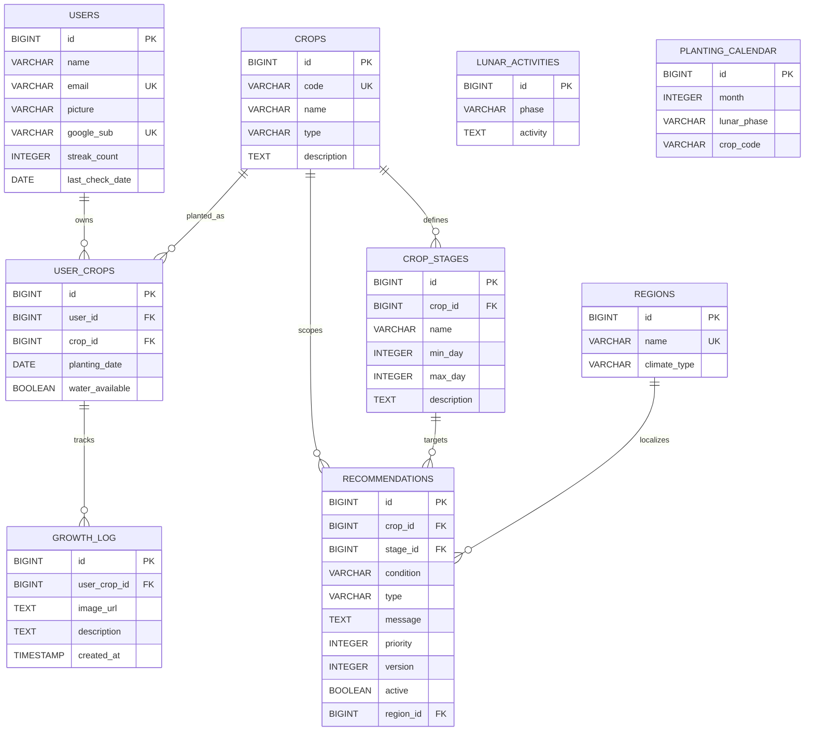
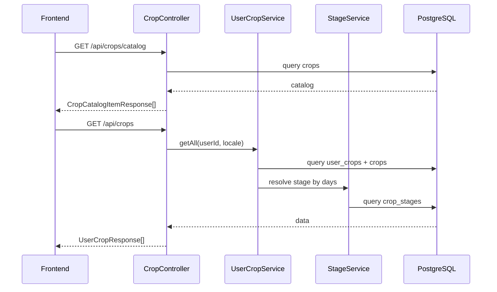
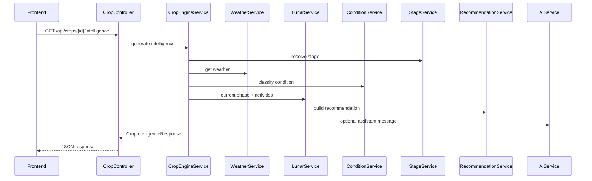
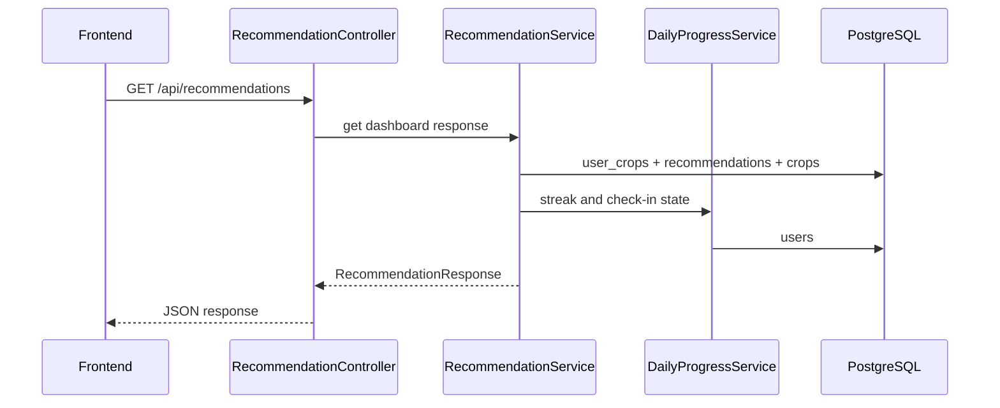

# LunaTierra Backend

Este documento resume la estructura actual de la base de datos y la arquitectura del backend Spring Boot después de la limpieza del código legacy.

## Base de datos

### Diagrama ER



### Lectura rápida del modelo

- `users`: perfil del usuario y progreso del hábito (`streak_count`, `last_check_date`)
- `crops`: catálogo dinámico de cultivos
- `crop_stages`: etapas por cultivo, resueltas por rango de días (`min_day`, `max_day`)
- `recommendations`: reglas dinámicas por cultivo, etapa, condición y región
- `regions`: catálogo opcional para regionalización futura
- `lunar_activities`: actividades sugeridas por fase lunar
- `planting_calendar`: qué sembrar según mes y fase lunar
- `user_crops`: cultivos activos de cada usuario
- `growth_log`: bitácora fotográfica por cultivo

### Índices relevantes

Según `schema.sql`, la base ya está optimizada en estos lookup paths:

- `crop_stages(crop_id)`
- `crop_stages(name)`
- `recommendations(crop_id)`
- `recommendations(stage_id)`
- `recommendations(condition)`
- `recommendations(crop_id, stage_id, condition, active, region_id)`
- `user_crops(crop_id)`
- `planting_calendar(month, lunar_phase)`

## Arquitectura backend

### Vista general por capas

```mermaid
flowchart TD
    Client[Frontend / Mobile Web]

    subgraph Controllers
        AuthController
        CropController
        RecommendationController
        DailyProgressController
        GrowthLogController
        LunarPhaseController
        OnboardingController
        QuestionController
        AdminController
        UserMigrationController
    end

    subgraph Services
        GoogleAuthService
        AuthenticatedUserService
        JwtService
        UserCropService
        CropEngineService
        RecommendationService
        DailyProgressService
        GrowthLogService
        LunarService
        LunarRecommendationService
        WeatherService
        StageService
        ConditionService
        CropCatalogService
        QuestionAnswerService
        AIService
        CropGrowthService
    end

    subgraph Repositories
        UserRepository
        UserCropRepository
        CropRepository
        CropStageRepository
        RecommendationRepository
        RegionRepository
        LunarActivityRepository
        PlantingCalendarRepository
        GrowthLogRepository
    end

    subgraph External
        PostgreSQL[(PostgreSQL)]
        OpenMeteo[Open-Meteo API]
        Ollama[Ollama / AI]
        Google[Google Identity]
        Uploads[uploads/ file storage]
    end

    Client --> Controllers

    AuthController --> GoogleAuthService
    GoogleAuthService --> UserRepository
    GoogleAuthService --> JwtService
    GoogleAuthService --> Google

    CropController --> UserCropService
    CropController --> CropEngineService
    CropController --> CropCatalogService
    CropController --> AuthenticatedUserService

    RecommendationController --> RecommendationService
    RecommendationController --> AuthenticatedUserService

    DailyProgressController --> DailyProgressService
    DailyProgressController --> AuthenticatedUserService

    GrowthLogController --> GrowthLogService
    GrowthLogController --> AuthenticatedUserService

    LunarPhaseController --> LunarService
    OnboardingController --> LunarRecommendationService
    QuestionController --> QuestionAnswerService
    AdminController --> CropCatalogService
    UserMigrationController --> UserCropService
    UserMigrationController --> AuthenticatedUserService

    CropEngineService --> StageService
    CropEngineService --> WeatherService
    CropEngineService --> LunarService
    CropEngineService --> ConditionService
    CropEngineService --> RecommendationService
    CropEngineService --> AIService

    RecommendationService --> UserCropService
    RecommendationService --> StageService
    RecommendationService --> ConditionService
    RecommendationService --> WeatherService
    RecommendationService --> LunarService
    RecommendationService --> DailyProgressService
    RecommendationService --> CropStageRepository
    RecommendationService --> RecommendationRepository

    CropCatalogService --> CropRepository
    CropCatalogService --> CropStageRepository
    CropCatalogService --> RecommendationRepository
    CropCatalogService --> RegionRepository
    CropCatalogService --> LunarActivityRepository
    CropCatalogService --> UserRepository

    UserCropService --> UserCropRepository
    UserCropService --> CropRepository
    UserCropService --> UserRepository
    UserCropService --> StageService
    UserCropService --> CropGrowthService

    GrowthLogService --> GrowthLogRepository
    GrowthLogService --> UserCropRepository

    LunarService --> LunarActivityRepository
    LunarService --> PlantingCalendarRepository
    LunarService --> CropRepository

    LunarRecommendationService --> LunarService
    LunarRecommendationService --> PlantingCalendarRepository

    QuestionAnswerService --> AIService
    AuthenticatedUserService --> JwtService
    AuthenticatedUserService --> UserRepository

    WeatherService --> OpenMeteo
    AIService --> Ollama

    UserRepository --> PostgreSQL
    UserCropRepository --> PostgreSQL
    CropRepository --> PostgreSQL
    CropStageRepository --> PostgreSQL
    RecommendationRepository --> PostgreSQL
    RegionRepository --> PostgreSQL
    LunarActivityRepository --> PostgreSQL
    PlantingCalendarRepository --> PostgreSQL
    GrowthLogRepository --> PostgreSQL
    GrowthLogService --> Uploads
```



## Flujos principales

### 1. Catálogo y cultivos del usuario



### 2. Motor de inteligencia agrícola



### 3. Dashboard diario



## Organización real del backend

```text
backend/src/main/java/com/lunatierra/backend
├── config
│   ├── OpenApiConfig
│   └── WebConfig
├── controller
│   ├── AdminController
│   ├── AuthController
│   ├── CropController
│   ├── DailyProgressController
│   ├── GrowthLogController
│   ├── LunarPhaseController
│   ├── OnboardingController
│   ├── QuestionController
│   └── UserMigrationController
├── dto
├── exception
├── mapper
├── model
├── repository
├── service
│   ├── AIService
│   ├── AuthenticatedUserService
│   ├── ConditionService
│   ├── CropCatalogService
│   ├── CropEngineService
│   ├── CropGrowthService
│   ├── DailyProgressService
│   ├── GoogleAuthService
│   ├── GrowthLogService
│   ├── JwtService
│   ├── LunarRecommendationService
│   ├── LunarService
│   ├── QuestionAnswerService
│   ├── RecommendationService
│   ├── StageService
│   ├── UserCropService
│   └── WeatherService
└── LunatierraApplication
```

## Limpieza aplicada

Se eliminó el bloque legacy que convivía con el motor principal:

- `RecomendacionController`
- `RecomendacionService`
- `ReglaAgronomica`
- `ReglaAgronomicaRepository`
- `RecommendationServiceDynamic`
- `CropService`
- `UserCropDetailService`
- `CropMapper`
- `CropStageMapper`
- `RecommendationMapper`
- DTOs antiguos asociados a esos flujos

## Núcleo productivo actual

El backend queda concentrado en un solo flujo core:

1. `CropController`
2. `RecommendationController`
3. `CropEngineService`
4. `RecommendationService`
5. `StageService`
6. `WeatherService`
7. `LunarService`
8. `UserCropService`
9. repositorios JPA del esquema actual
